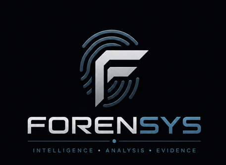
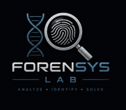
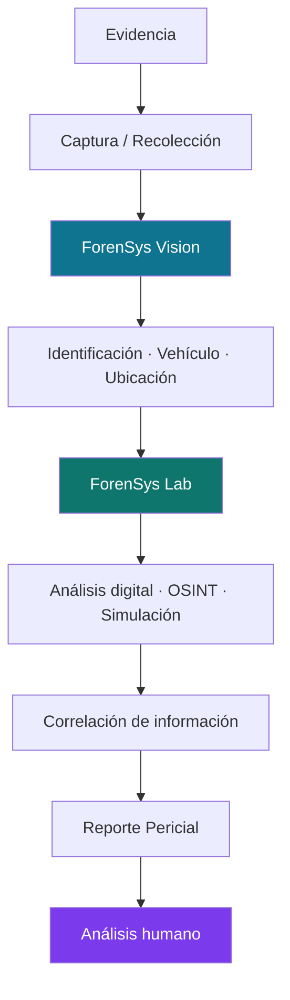
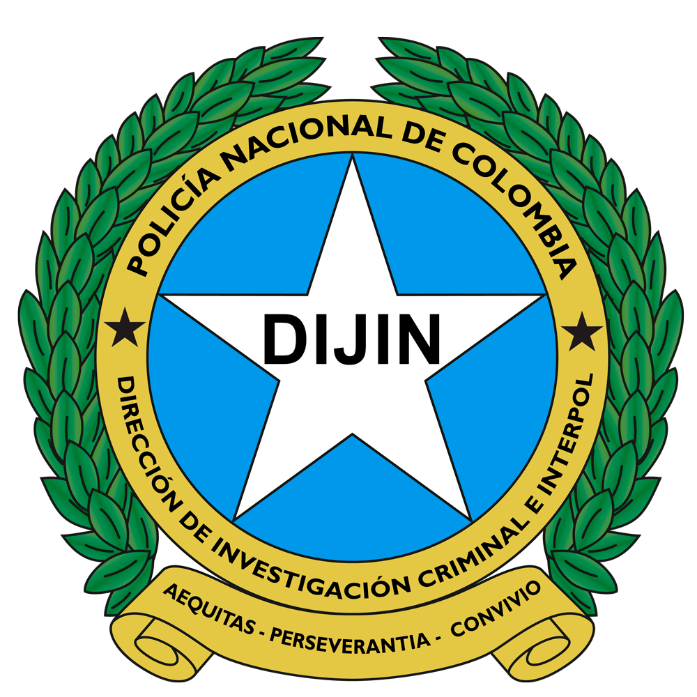
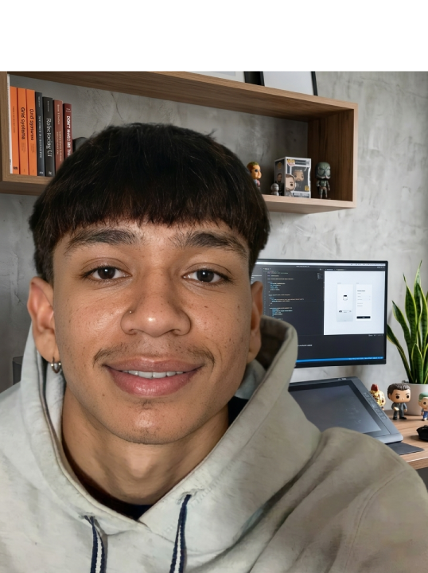

<div align="center">



# ForenSys

### Suite modular para investigación judicial y análisis forense

Visión artificial · Análisis digital · OSINT · Georreferenciación · Reportes periciales

<br/>


<br/>

[Ecosistema](#-el-ecosistema) ·
[Aplicaciones](#-aplicaciones) ·
[Flujo de trabajo](#-flujo-de-investigación) ·
[Arquitectura](#-arquitectura) ·
[Tecnologías](#-tecnologías) ·
[Repositorios](#-repositorios-del-proyecto) ·
[Autor](#-autor)

</div>

---

## 📖 ¿Qué es ForenSys?

**ForenSys** es un ecosistema tecnológico que integra **visión artificial, análisis digital, inteligencia investigativa, georreferenciación y herramientas especializadas** para apoyar procesos de identificación, análisis de evidencias, reconstrucción investigativa y generación de información pericial.

Está organizado en **dos plataformas** y **ocho aplicaciones**, de forma que cada etapa de una investigación (desde la captura de la evidencia hasta el reporte final) pueda abordarse desde un mismo entorno.

> Este repositorio contiene el **sitio web de presentación** de la suite. El código de cada plataforma vive en su propio repositorio (ver [Repositorios del proyecto](#-repositorios-del-proyecto)).

> [!IMPORTANT]
> **ForenSys es una herramienta de apoyo.** Sus resultados deben ser interpretados y verificados por personal competente y **no sustituyen el criterio profesional del investigador o perito**.

---

## 🧩 El ecosistema

<table>
<tr>
<td align="center" width="50%">


### ForenSys Vision
Análisis visual, identificación y apoyo a la investigación operativa.

</td>
<td align="center" width="50%">



### ForenSys Lab
Análisis forense, investigación digital y herramientas especializadas.

</td>
</tr>
</table>

---

## 🛠️ Aplicaciones

### 👁️ ForenSys Vision

| Aplicación | Categoría | Descripción | Estado |
|---|---|---|---|
| **Reconocimiento Facial** | Visión artificial | Detección y comparación de rostros como apoyo a procesos de identificación. | ✅ Implementado |
| **Reconocimiento de Placas** | Visión artificial / OCR | Detección de vehículos y lectura de placas (YOLO + OCR). | 🧪 Prototipo |
| **Trazador de Rutas** | Geoespacial | Mapa interactivo para representar ubicaciones y posibles trayectorias. | 🧪 Prototipo |
| **Reporte Pericial** | Documentación | Generación de informes PDF estructurados a partir de los resultados. | ✅ Implementado |

### 🔬 ForenSys Lab

| Aplicación | Categoría | Descripción | Estado |
|---|---|---|---|
| **Mobile / Cloud** | Movilidad | Extensión del ecosistema para trabajo desde dispositivos móviles. | 🚧 En desarrollo |
| **Cyber & MetaInspect** | Investigación digital | Análisis de imágenes, metadatos técnicos y datos EXIF. | ✅ Implementado |
| **Ballistics 3D** | Simulación 3D | Simulación y representación tridimensional de trayectorias de proyectiles. | ✅ Implementado |
| **OSINT & NetTracker** | Inteligencia | Investigación en fuentes abiertas y correlación de información pública. | ✅ Implementado |

---

## 🔄 Flujo de investigación

ForenSys conecta las etapas de una investigación, del hallazgo al análisis:



---

## 🏗️ Arquitectura

```text
[ FORENSYS CORE ]
│
├── VISION
│   ├── FACE
│   ├── LPR
│   ├── ROUTES
│   └── REPORTS
│
└── LAB
    ├── MOBILE
    ├── METAINSPECT
    ├── BALLISTICS
    └── OSINT
```

---

## 💻 Tecnologías

| Área | Herramientas |
|---|---|
| **Visión artificial** | `OpenCV`, `YuNet` (FaceDetectorYN), modelos de detección de vehículos |
| **IA / OCR** | Modelos de aprendizaje profundo preentrenados y OCR para placas |
| **Backend & API** | `Python`, `FastAPI` |
| **Datos** | `SQLite`, `SQLAlchemy` |
| **Investigación digital** | `ExifTool`, metodologías tipo `Sherlock` para OSINT |
| **Geoespacial** | `Folium`, `Leaflet` |
| **Sitio web** | HTML5, CSS3, JavaScript (vanilla) |

---

## 🎯 ¿Dónde puede utilizarse?

<div align="center">
<table>
<tr>
<td align="center"><br/><sub><b>Policía Nacional</b></sub></td>
<td align="center"><br/><sub><b>CTI</b></sub></td>
<td align="center"><br/><sub><b>DIJIN</b></sub></td>
</tr>
</table>
</div>

Como apoyo técnico, educativo o investigativo en:

- Laboratorios de criminalística
- Laboratorios de informática forense
- Instituciones educativas
- Centros de investigación
- Empresas privadas de seguridad

**Casos de uso**

| Caso | Capacidad |
|---|---|
| Identificación | Reconocimiento facial |
| Análisis vehicular | Reconocimiento de placas |
| Reconstrucción | Análisis de ubicaciones y trayectorias |
| Evidencia digital | Metadatos e imágenes |
| Investigación digital | Inteligencia de fuentes abiertas (OSINT) |
| Análisis especializado | Simulación de balística 3D |
| Documentación | Reportes periciales en PDF |
| Movilidad | Operación desde dispositivos soportados |

---

## 📸 Capturas

<!-- Reemplaza los nombres por los archivos reales de tu carpeta /imagenes -->

| ForenSys Vision | ForenSys Lab |
|:---:|:---:|
|  |  |

---

## 🚀 Ejecutar el sitio localmente

Este repositorio es un sitio estático, no requiere instalación de dependencias.

```bash
# 1. Clonar el repositorio
git clone https://github.com/AndresGonzalezDev444/ForenSys.git
cd ForenSys

# 2. Abrir index.html en el navegador, o servirlo localmente:
python -m http.server 8000
# → http://localhost:8000
```

> Se recomienda usar un servidor local, ya que el sitio referencia recursos con rutas absolutas (`/imagenes/...`).

**Estructura del repositorio**

```text
ForenSys/
├── imagenes/      # Logos, capturas y recursos gráficos
├── index.html     # Página principal
├── main.js        # Interacciones, animaciones y galería
└── style.css      # Estilos
```

---

## 📦 Repositorios del proyecto

<table>
<tr>
<td align="center" width="50%">
<br/>
<b>ForenSys Vision</b><br/>
<a href="https://github.com/AndresGonzalezDev444/ForenSys-Vision">Ver repositorio →</a>
</td>
<td align="center" width="50%">
<br/>
<b>ForenSys Lab</b><br/>
<a href="https://github.com/AndresGonzalezDev444/ForenSys-Lab">Ver repositorio →</a>
</td>
</tr>
</table>

---

## ⚖️ Uso responsable

ForenSys está pensado para uso **académico, investigativo y en entornos debidamente autorizados**. Quien lo utilice es responsable de cumplir la normativa aplicable sobre protección de datos personales, cadena de custodia y uso de información biométrica.

---

## 👨‍💻 Autor

<table>
<tr>
<td width="110" align="center">

</td>
<td>

**Robinson Andrés González Quintero**
Desarrollador de software y entusiasta de la ciberseguridad, enfocado en crear soluciones tecnológicas aplicadas a la investigación y el análisis.

[](https://github.com/AndresGonzalezDev444)
[](https://www.linkedin.com/in/andres-gonzalez444)
[](https://andresgonzalezdev.me)

</td>
</tr>
</table>

---

<div align="center">


**© 2026 ForenSys** — Prototipo tecnológico e investigativo.

</div>
